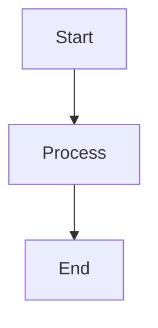

# Code-to-Slide Generator

I developed this script to enhance technical instruction by generating high-quality code visualizations for lecture slides. It is designed specifically for Google Slides (16:9) to provide students with clear, legible code comparisons.

## 🚀 Features
- **16:9 Aspect Ratio:** Optimized at 1920x1080 for seamless slide integration.
- **Side-by-Side Comparison:** Compare two snippets (e.g., C and Python) in a single frame.
- **Dynamic Font Scaling:** Automatically calculates the optimal font size to maximize legibility.
- **Inline Line Numbers:** Facilitates direct referencing during lectures.
- **Language Watermarks:** Subtle identification of syntax highlighting.
- **Math Equation Slides:** Render LaTeX equations and TikZ/tikzcd diagrams alongside code.
- **Mermaid Diagram Slides:** Render flowcharts, sequence diagrams, ER diagrams, and more.

## 🛠 Dependencies
- `pygments`
- `playwright` (Requires: `playwright install chromium`)

## 💻 Usage
```bash
# Single code file
python main.py source.py -o slide.png

# Side-by-side code comparison
python main.py source.py --file2 comparison.c -o slide.png
```

## ∑ Math Equation Slides

Create a `.math` file containing a LaTeX equation wrapped in `$$`:

```
$$\frac{-b \pm \sqrt{b^2 - 4ac}}{2a}$$
```

For commutative diagrams and TikZ figures, add `\usepackage` declarations at the top of the file:

```
\usepackage{tikzcd}
$$
\begin{tikzcd}
A \arrow[r, "f"] \arrow[d, "g"'] & B \arrow[d, "h"] \\
C \arrow[r, "k"'] & D
\end{tikzcd}
$$
```

Supported TikZ packages: `tikzcd`, `tikz`, `pgf`, `pgfplots`, `circuitikz`, `pgfplotstable`.

Standard equations are rendered with **KaTeX**. Files using TikZ packages are rendered with **TikZJax** (WebAssembly). Both are loaded from CDN automatically — no local LaTeX installation required.

```bash
# Single math slide
python main.py equation.math -o slide.png

# Side-by-side: code + equation
python main.py source.py --file2 equation.math -o slide.png

# Two equations side-by-side
python main.py eq1.math --file2 eq2.math -o slide.png
```

## ◈ Mermaid Diagram Slides

Create a `.mmd` file using the standard markdown code fence syntax:

````

````

All Mermaid diagram types are supported: flowcharts, sequence diagrams, class diagrams, ER diagrams, Gantt charts, and more. The diagrams are automatically styled to match the Ground Mode palette. Mermaid.js is loaded from CDN — no local installation required.

```bash
# Single diagram slide
python main.py diagram.mmd -o slide.png

# Side-by-side: code + diagram
python main.py source.py --file2 diagram.mmd -o slide.png

# Two diagrams side-by-side
python main.py flow.mmd --file2 sequence.mmd -o slide.png
```

---
*Note: I plan on adding further features to support more complex lecture requirements.*
